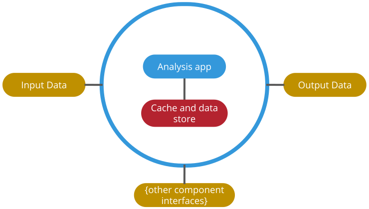

.. _a_chapter:

=========
A Chapter
=========

Here is a paragraph

Here are:
    - several
    - bullet
    - points

    This is the caption of an svg file

.. _a_section:

A Section
=========

A link in rst is like
`this <https://www.octue.com>`_.

You cna create numbered bullets too. Here are some things that were important in the library which I made this template from:

#. Openness
#. Federation
#. Security
#. Public Good (cross ref other parts of the docs like this... :ref:`using_group_tabs`)

.. _using_group_tabs:

[Simple] Using Group Tabs
=========================

.. tabs::

   .. group-tab:: Scenario

      Some text appears in a tabbed box

   .. group-tab:: Twine

      A box can have ``code_values``.

      And multiple paragraphs

      .. code-block:: javascript

         {
             "and": "A Code Block",
         }
